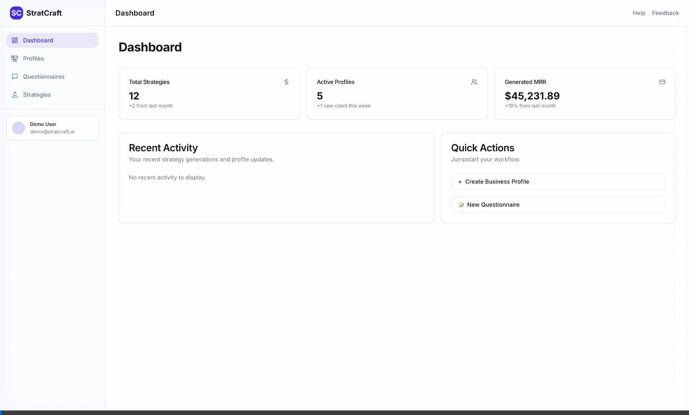
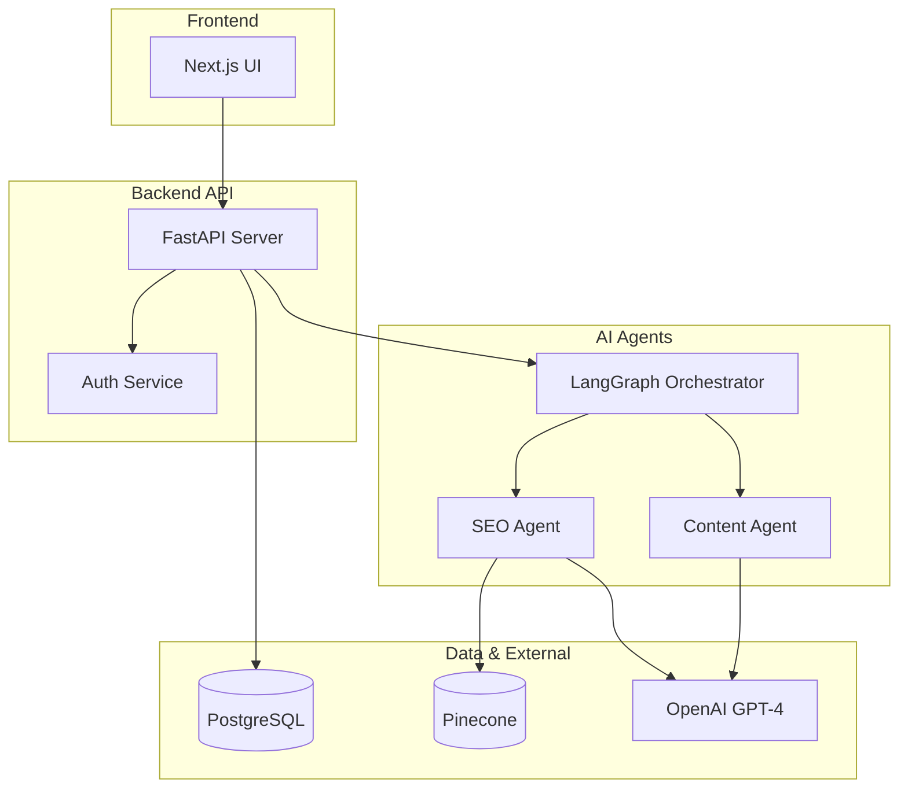
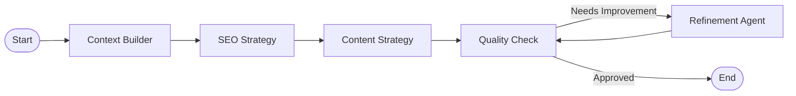

# StratCraft AI - AI-Powered Marketing Strategy Generator

A monolithic SaaS platform that generates customized marketing strategies by combining business intelligence with client objectives using AI agents.

## 🎯 What is StratCraft AI?

StratCraft AI transforms how agencies create marketing proposals. Instead of spending 8-15 hours crafting each strategy, generate comprehensive, customized proposals in 10 minutes.

**Formula:** `Common Input (Business Data) + Input (Client Questionnaire) = AI-Generated Strategy`

## 🎥 Demo Walkthrough

Check out the fully functional MVP in action:



## 🏗️ Architecture

This is a **monorepo** containing:

- **Backend**: FastAPI + PostgreSQL + LangGraph AI agents
- **Frontend**: Next.js 14 + TypeScript + TailwindCSS

### High-Level Design (HLD)



### Agent Workflow (LLD)



```
strat-craft-ai-service/
├── backend/           # FastAPI service
├── frontend/          # Next.js UI
├── docs/             # Documentation
└── examples/         # Sample data & use cases
```

## 🚀 Quick Start

### Prerequisites

- Python 3.11+
- Node.js 18+
- PostgreSQL 15+
- OpenAI API key

### Backend Setup

```bash
cd backend
python -m venv venv
source venv/bin/activate  # On Windows: venv\Scripts\activate
pip install -r requirements.txt
cp .env.example .env      # Configure your environment variables
alembic upgrade head      # Run database migrations
uvicorn app.main:app --reload
```

Backend will run at: `http://localhost:8000`
API docs at: `http://localhost:8000/docs`

### Frontend Setup

```bash
cd frontend
npm install
cp .env.local.example .env.local  # Configure environment
npm run dev
```

Frontend will run at: `http://localhost:3000`

## 📚 Documentation

- [System Architecture](https://github.com/kuldeep27396/strat-craft-ai-service/blob/main/docs/architecture.md)
- [API Documentation](http://localhost:8000/docs) (when running)
- [Database Schema](https://github.com/kuldeep27396/strat-craft-ai-service/blob/main/docs/database-schema.md)
- [AI Agent Workflow](https://github.com/kuldeep27396/strat-craft-ai-service/blob/main/docs/agent-workflow.md)

## 🛠️ Tech Stack

| Layer | Technology |
|-------|------------|
| **Backend** | FastAPI, SQLAlchemy, LangGraph, LangChain |
| **Frontend** | Next.js 14, TypeScript, TailwindCSS, shadcn/ui |
| **Database** | PostgreSQL, Pinecone (Vector DB) |
| **AI** | OpenAI GPT-4 / Anthropic Claude |
| **Deployment** | Docker, Railway/Vercel |

## 🎯 Features

### MVP (Current)

- [x] Business profile management
- [x] Client questionnaire builder
- [ ] AI-powered SEO strategy generation
- [ ] PDF export

### Roadmap

- Multi-channel strategies (Content, ABM, Social)
- Strategy editor with real-time collaboration  
- Template marketplace
- Team workspaces
- White-label branding

## 🤝 Contributing

```bash
# Create a feature branch
git checkout -b feature/your-feature-name

# Make changes and commit
git commit -m "feat: add amazing feature"

# Push and create PR
git push origin feature/your-feature-name
```

## 📄 License

MIT License - see LICENSE file for details

## 🙋 Support

- Issues: [GitHub Issues](https://github.com/kuldeep27396/strat-craft-ai-service/issues)
- Email: <support@stratcraft.ai> (coming soon)

---

**Built with ❤️ by StratCraft AI Team**
