# System Design & Backend Development: A Complete Guide

> Learn backend development and system design through the StratCraft AI codebase

---

## Table of Contents

1. [Introduction](#1-introduction)
2. [System Architecture](#2-system-architecture)
3. [Design Principles](#3-design-principles)
4. [Design Patterns](#4-design-patterns)
5. [Database Design](#5-database-design)
6. [API Design](#6-api-design)
7. [Authentication & Authorization](#7-authentication--authorization)
8. [Caching Strategies](#8-caching-strategies)
9. [Scalability Patterns](#9-scalability-patterns)
10. [Testing Strategy](#10-testing-strategy)
11. [Deployment](#11-deployment)
12. [Monitoring & Observability](#12-monitoring--observability)

---

## 1. Introduction

### What is Backend Development?

**Backend development** is the practice of building the "server-side" of applications - the parts that users don't see but that power everything. Think of it as the **kitchen** in a restaurant:

| Frontend (Kitchen Staff See) | Backend (Kitchen Operations) |
|------------------------------|------------------------------|
| Waiters show the menu | Waiters take orders to kitchen |
| Food presentation visible | Cooking happens behind scenes |
| Customer experience | Recipes, inventory, staffing |

### The StratCraft AI Architecture

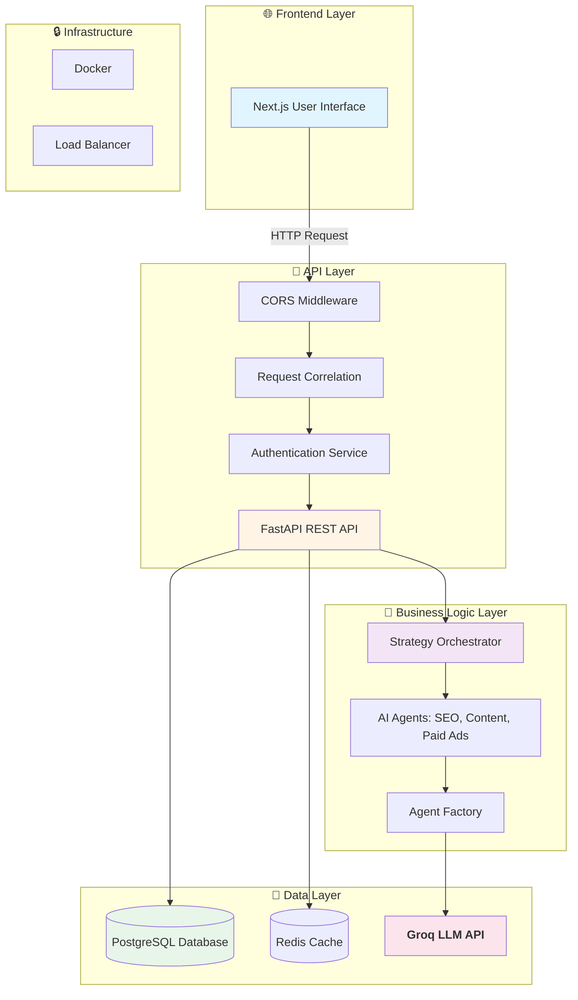

### Tech Stack Overview

| Layer | Technology | Purpose |
|-------|------------|---------|
| <span style="color:#e1f5ff">■</span> **Frontend** | Next.js 14 | React framework for user interface |
| <span style="color:#fff4e6">■</span> **Backend** | FastAPI | High-performance Python web framework |
| <span style="color:#e8f5e9">■</span> **Database** | PostgreSQL | Relational database for persistent data |
| <span style="color:#fce4ec">■</span> **AI/LLM** | Groq (Llama 3.1) | Fast inference for AI generation |
| <span style="color:#f3e5f5">■</span> **Orchestration** | LangGraph | Multi-agent workflow management |
| <span style="color:#e0f2f1">■</span> **Caching** | Redis | Fast in-memory data store |
| <span style="color:#fff9c4">■</span> **Container** | Docker | Application containerization |

---

## 2. System Architecture

### What is System Architecture?

**System architecture** is like a **building blueprint** - it defines how all parts of your system connect and work together. A good architecture makes your system:

- 🏗️ **Maintainable** - Easy to fix and update
- 📈 **Scalable** - Can handle more users
- 🔒 **Secure** - Protects user data
- ⚡ **Performant** - Fast response times

### Layered Architecture

Our system uses **layered architecture** - a common pattern where each layer has a specific responsibility:

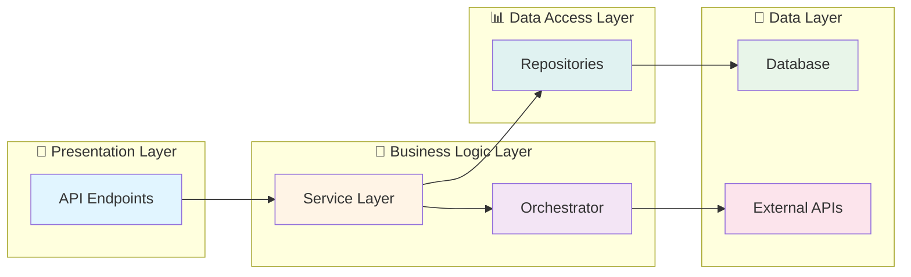

**Why use layers?**

| Benefit | Real-World Analogy |
|---------|-------------------|
| **Separation of Concerns** | Kitchen staff doesn't seat guests |
| **Reusability** | Same database code used by API and CLI |
| **Testability** | Can test each layer independently |
| **Flexibility** | Change database without touching API |

### Our Project Structure

```
backend/app/
├── 📁 api/                    # Presentation Layer - API endpoints
│   ├── auth.py                # Login, register, tokens
│   ├── profiles.py            # Business profile CRUD
│   ├── questionnaires.py      # Questionnaire management
│   ├── strategies.py          # Strategy generation
│   └── health.py              # Health check endpoints
│
├── 📁 agents/                 # Business Logic - AI orchestration
│   ├── orchestrator.py        # Main workflow coordinator
│   ├── factory.py             # Creates agent instances
│   └── base.py                # Base agent classes
│
├── 📁 infrastructure/         # Data Access - External integrations
│   ├── llm.py                 # Groq LLM integration
│   └── repositories.py        # Database access
│
├── 📁 interfaces/             # Contracts & Abstractions
│   ├── llm_provider.py        # LLM interface
│   ├── agents.py              # Agent interface
│   └── repositories.py        # Repository interface
│
├── 📁 models/                 # Database Models (ORM)
│   ├── user.py                # User table
│   ├── business_profile.py    # Business profile table
│   ├── questionnaire.py       # Questionnaire table
│   └── strategy.py            # Strategy table
│
├── 📁 schemas/                # Request/Response Validation
│   ├── user.py                # User DTOs
│   ├── agent_output.py        # AI response schemas
│   └── strategy.py            # Strategy DTOs
│
├── 📁 utils/                  # Utility functions
│   ├── resilience.py          # Retry, circuit breaker
│   ├── logging.py             # Structured logging
│   └── timeouts.py            # Timeout handlers
│
├── 📁 middleware/             # Request/Response processing
│   └── correlation.py         # Request ID tracking
│
└── main.py                    # Application entry point
```

### Request Flow Diagram

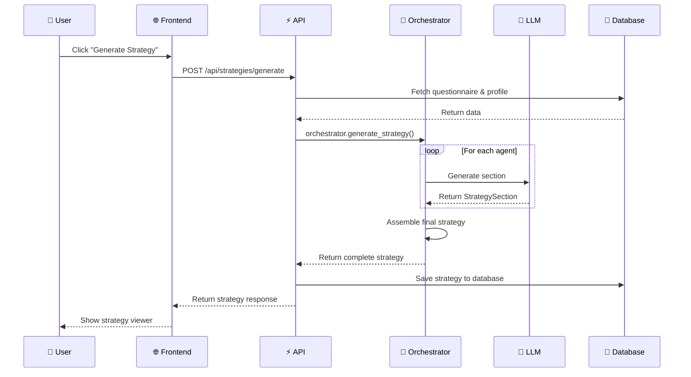

---

## 3. Design Principles

Design principles are **guidelines** that help you write better code. Think of them as **rules of thumb** from experienced developers.

### SOLID Principles

SOLID is an acronym for **five design principles** that help make software more:

- 🧩 **Maintainable** - Easier to fix bugs
- 🔄 **Extensible** - Easier to add features
- 🧪 **Testable** - Easier to write tests

#### S - Single Responsibility Principle (SRP)

**A class should have only one reason to change.**

📖 **In Plain English:** Each class should do **one thing** really well.

❌ **Bad Example:**
```python
class UserManager:
    def create_user(self): ...
    def send_email(self): ...        # Email sending?
    def generate_report(self): ...    # Report generation?
```
✅ **Good Example:**
```python
class UserCreator:
    def create(self): ...              # Only creates users

class EmailService:
    def send(self): ...                # Only sends emails

class ReportGenerator:
    def generate(self): ...            # Only generates reports
```

**In Our Project:**
| Class | Responsibility |
|-------|----------------|
| `SQLAlchemyStrategyRepository` | Database operations for strategies |
| `StrategyOrchestrator` | Coordinates agent workflow |
| `GroqLLMProvider` | Provides LLM instances |

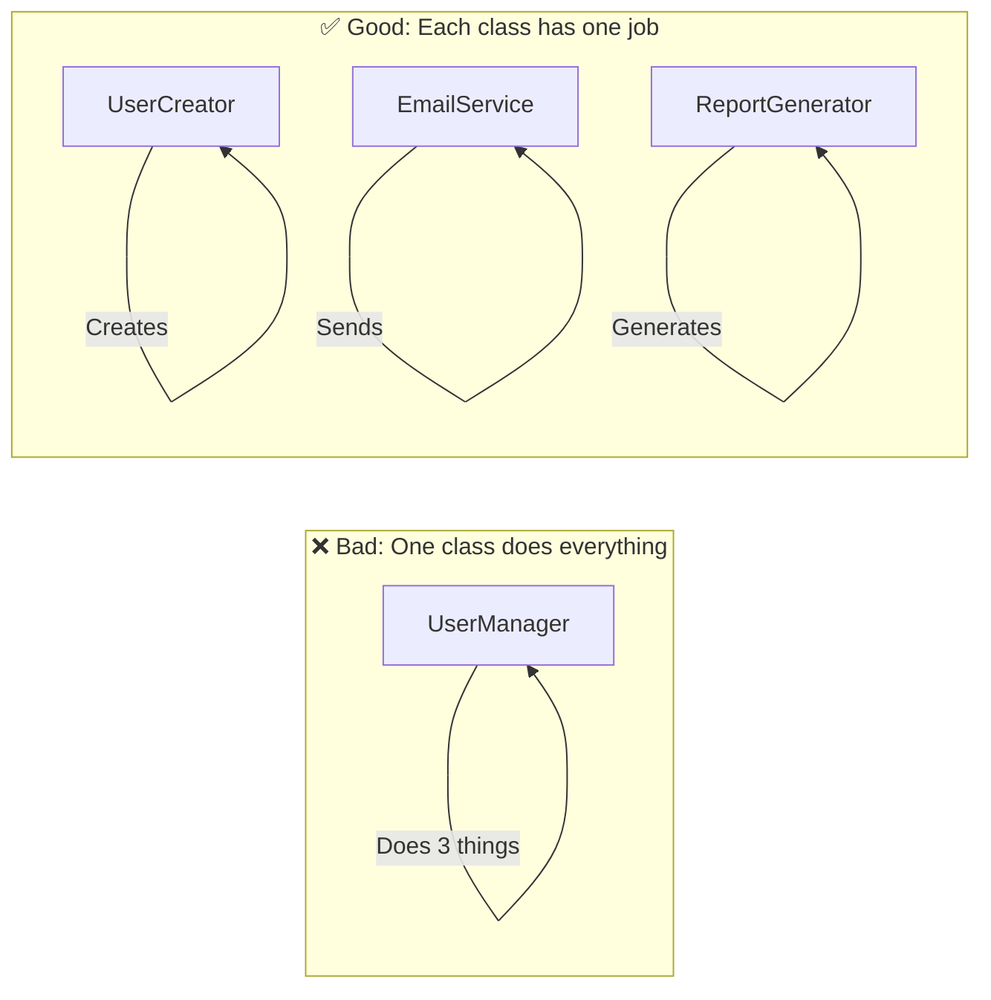

#### O - Open/Closed Principle (OCP)

**Software entities should be open for extension, but closed for modification.**

📖 **In Plain English:** You should be able to add new features **without changing existing code**.

❌ **Bad Example:**
```python
def process_payment(payment_type, amount):
    if payment_type == "credit_card":
        # Process credit card
    elif payment_type == "paypal":
        # Process PayPal
    elif payment_type == "apple_pay":
        # Must modify this function!
```

✅ **Good Example:**
```python
class PaymentProcessor(ABC):
    @abstractmethod
    def process(self, amount): pass

class CreditCardProcessor(PaymentProcessor):
    def process(self, amount): ...     # Implement credit card

class PayPalProcessor(PaymentProcessor):
    def process(self, amount): ...      # Implement PayPal

# New payment type? Just add a new class!
class ApplePayProcessor(PaymentProcessor):
    def process(self, amount): ...      # No changes needed!
```

**In Our Project - Agent Factory:**
```python
# ✅ Open for extension: Add new agents via factory
class AgentFactory:
    PROMPTS = {
        "seo": {...},
        "content": {...},
        # Add new agent here without modifying factory logic!
    }

    AGENT_CLASSES = {
        "seo": SEOAgent,
        "content": ContentAgent,
        # Just add new entry for new agents!
    }
```

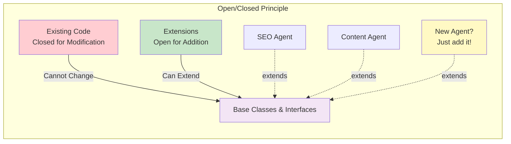

#### L - Liskov Substitution Principle (LSP)

**Subtypes must be substitutable for their base types.**

📖 **In Plain English:** If you have a parent class, you should be able to use any child class **without breaking anything**.

❌ **Bad Example:**
```python
class Bird:
    def fly(self): print("Flying")

class Penguin(Bird):          # Penguins are birds
    def fly(self): raise Exception("Penguins can't fly!")  # Breaks LSP!
```

✅ **Good Example:**
```python
class Bird:
    def move(self): pass        # General movement

class FlyingBird(Bird):
    def move(self): print("Flying")

class Penguin(Bird):
    def move(self): print("Walking")  # Doesn't break anything!
```

**In Our Project - LLM Providers:**
```python
# Abstract interface
class LLMProvider(ABC):
    @abstractmethod
    def get_model(self, name): ...

# Can use any provider that implements LLMProvider
class GroqLLMProvider(LLMProvider):
    def get_model(self, name): return ChatGroq(...)

class OpenAILLMProvider(LLMProvider):     # New provider
    def get_model(self, name): return ChatOpenAI(...)

# Works with any provider!
def create_orchestrator(provider: LLMProvider):
    return StrategyOrchestrator(provider)
```

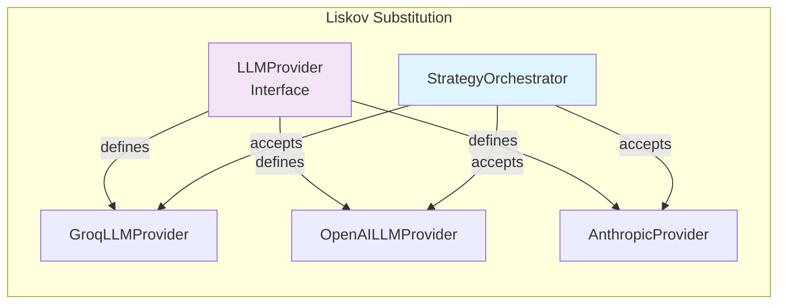

#### I - Interface Segregation Principle (ISP)

**Clients shouldn't depend on interfaces they don't use.**

📖 **In Plain English:** Keep interfaces **small and focused**. Don't force classes to implement methods they don't need.

❌ **Bad Example:**
```python
class Worker(ABC):                  # Too broad!
    @abstractmethod
    def work(self): pass

    @abstractmethod
    def eat_lunch(self): pass       # Not all workers eat lunch!

    @abstractmethod
    def attend_meeting(self): pass  # Some workers don't have meetings!
```

✅ **Good Example:**
```python
class Worker(ABC):                  # Focused
    @abstractmethod
    def work(self): pass

class LunchBreak(ABC):              # Separate interface
    @abstractmethod
    def eat_lunch(self): pass

class MeetingAttendee(ABC):         # Separate interface
    @abstractmethod
    def attend_meeting(self): pass
```

**In Our Project:**
```python
# ✅ Small, focused interfaces
class LLMProvider(ABC):                     # Only LLM-related
    def get_model(self): ...

class Repository(ABC):                      # Only data access
    def get_by_id(self): ...
    def save(self): ...

# Each class only implements what it needs
class GroqLLMProvider(LLMProvider):         # Only LLM methods
    def get_model(self): ...

class SQLAlchemyRepository(Repository):     # Only repository methods
    def get_by_id(self): ...
    def save(self): ...
```

#### D - Dependency Inversion Principle (DIP)

**Depend on abstractions, not concretions.**

📖 **In Plain English:** Depend on **interfaces** (abstract classes), not **concrete implementations**. This makes your code flexible.

❌ **Bad Example:**
```python
class OrderProcessor:
    def __init__(self):
        self.db = MySQLDatabase()        # Hard-coded! Cannot change.
        self.email = SendGridEmail()      # Locked into SendGrid!
```

✅ **Good Example:**
```python
class OrderProcessor:
    def __init__(self, db: Database, email: EmailService):  # Interfaces!
        self.db = db
        self.email = email

# Can inject any implementation!
processor = OrderProcessor(
    db=PostgreSQLDatabase(),      # Easy to swap
    email=AWSEmailService()        # Easy to swap
)
```

**In Our Project:**
```python
# ✅ Depend on abstractions
class StrategyOrchestrator:
    def __init__(self, config: OrchestratorConfig):  # Abstract config
        self.llm = config.llm_provider      # LLMProvider interface
        self.repo = config.strategy_repo    # Repository interface

# Can inject any implementation
orchestrator = StrategyOrchestrator(
    OrchestratorConfig(
        llm_provider=GroqLLMProvider(),         # Could be OpenAI!
        strategy_repo=SQLAlchemyStrategyRepo()  # Could be MongoRepo!
    )
)
```

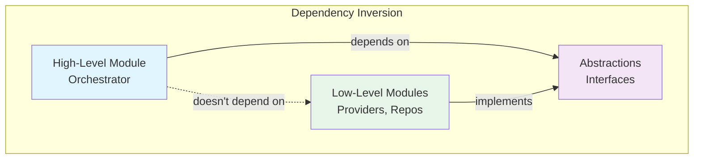

### DRY Principle (Don't Repeat Yourself)

**Every piece of knowledge must have a single, unambiguous representation.**

📖 **In Plain English:** If you're copying and pasting code, you're probably doing it wrong.

❌ **Bad Example:**
```python
def get_user_profile(user_id):
    conn = psycopg2.connect(database_url)
    cursor = conn.cursor()
    cursor.execute("SELECT * FROM users WHERE id = %s", (user_id,))
    result = cursor.fetchone()
    conn.close()
    return result

def get_questionnaire(q_id):
    conn = psycopg2.connect(database_url)        # Duplicated!
    cursor = conn.cursor()                        # Duplicated!
    cursor.execute("SELECT * FROM questionnaires WHERE id = %s", (q_id,))
    result = cursor.fetchone()
    conn.close()
    return result
```

✅ **Good Example:**
```python
class Repository:                                 # Define once
    def __init__(self, model):
        self.model = model

    def get_by_id(self, id):
        return self.session.query(self.model).filter_by(id=id).first()

user_repo = Repository(User)
questionnaire_repo = Repository(Questionnaire)
```

**In Our Project:**
```python
# ✅ DRY: Base repository handles common operations
class BaseSQLAlchemyRepository(BaseRepository):
    def get_by_id(self, id): ...           # Defined once
    def save(self, entity): ...            # Defined once

    # All repositories inherit these!
class StrategyRepository(BaseSQLAlchemyRepository):
    pass  # Gets all CRUD for free!

# ✅ DRY: Single agent runner
async def _run_agent(self, agent, state):  # One function
    if agent.should_skip(state['context']):
        return state
    result = await agent.execute(state['context'])
    state['sections'][agent.state_key] = result
    return state

# Used for ALL agents - no duplication!
for agent in self.agents:
    workflow.add_node(agent.state_key, lambda s, a=agent: self._run_agent(a, s))
```

### YAGNI Principle (You Aren't Gonna Need It)

**Don't build things you might need later. Build only what you need now.**

📖 **In Plain English:** Avoid **speculative development**. Build features when there's a **real requirement**.

❌ **Bad Example:**
```python
class StrategyService:
    def generate(self): ...

    def export_to_pdf(self): ...       # Not needed yet!
    def export_to_word(self): ...      # Not needed yet!
    def export_to_powerpoint(self): ... # Not needed yet!
    def schedule_generation(self): ...  # Not needed yet!
    def email_strategy(self): ...       # Not needed yet!
```

✅ **Good Example:**
```python
class StrategyService:
    def generate(self): ...            # Only what's needed now

    # Add export_to_pdf when it's actually required!
```

**In Our Project:**
```python
# ✅ YAGNI: Removed unused research model
# Before:
GROQ_RESEARCH_MODEL: str = "mixtral-8x7b"  # Not used!

# After: Removed it - not needed

# ✅ YAGNI: Removed unused schemas
# Before:
class AgentState(BaseModel):              # Never used!
class StrategyContent(BaseModel):         # Never used!

# After: Deleted - YAGNI
```

### Principles Summary Table

| Principle | Simple Rule | Our Implementation |
|-----------|-------------|-------------------|
| **SRP** | One class = one job | `GroqLLMProvider` only provides LLMs |
| **OCP** | Open for extension, closed for modification | Add agents via factory, no core changes |
| **LSP** | Substitutable implementations | Any `LLMProvider` works |
| **ISP** | Small, focused interfaces | Separate `LLMProvider`, `Repository` interfaces |
| **DIP** | Depend on abstractions | `Orchestrator` depends on interfaces |
| **DRY** | Don't repeat code | Base repository, shared `_run_agent` |
| **YAGNI** | Build only what's needed | Removed unused models, schemas |

---

## 4. Design Patterns

### What are Design Patterns?

**Design patterns** are **reusable solutions** to common problems. Think of them as **blueprints** or **templates** that experienced developers have created over time.

> 💡 **Analogy:** Like cooking recipes - you don't reinvent cooking techniques, you follow proven recipes!

### Pattern Categories

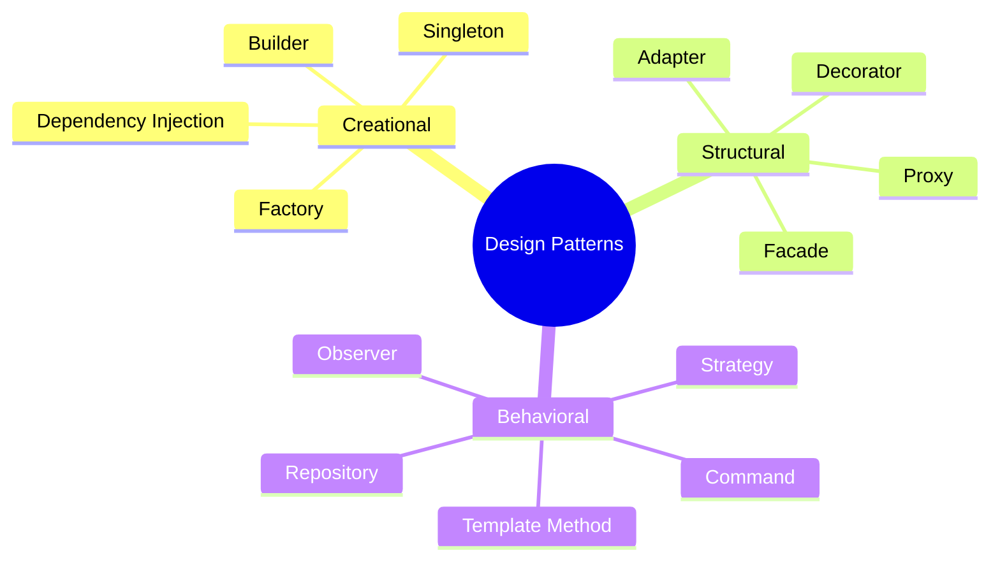

### Pattern 1: Factory Pattern

**Purpose:** Create objects without specifying the exact class.

📖 **Real-World Analogy:** A car factory produces cars. You order "a car" and get one without knowing which machine built it.

#### Our Implementation

```python
# backend/app/agents/factory.py
class AgentFactory:
    """Factory for creating agent instances."""

    PROMPTS = {
        "seo": {"system": "...", "user": "..."},
        "content": {"system": "...", "user": "..."},
    }

    AGENT_CLASSES = {
        "seo": SEOAgent,
        "content": ContentAgent,
    }

    def create_agent(self, agent_type: str) -> Agent:
        """Create agent by type."""
        prompts = self.PROMPTS[agent_type]
        chain = self.chain_factory.create_strategy_chain(...)
        agent_class = self.AGENT_CLASSES[agent_type]
        return agent_class(chain, state_key)
```

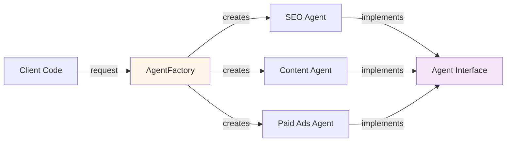

**Benefits:**
| Benefit | Explanation |
|---------|-------------|
| **Decoupling** | Client doesn't know concrete classes |
| **Extensibility** | Add new agents without changing client code |
| **Centralized** | All creation logic in one place |

### Pattern 2: Strategy Pattern

**Purpose:** Define a family of algorithms and make them interchangeable.

📖 **Real-World Analogy:** GPS navigation - you can switch between "fastest route", "shortest route", "avoid highways" without changing the GPS.

#### Our Implementation

```python
# backend/app/agents/base.py
class BaseLLMAgent(ABC):
    """Abstract base for all agents."""

    @abstractmethod
    async def execute(self, context): ...  # Each agent implements differently

    @abstractmethod
    def should_skip(self, context): ...     # Each agent has own logic

# Concrete strategies
class SEOAgent(BaseLLMAgent):
    async def execute(self, context):
        return await self.chain.ainvoke(self._build_seo_params(context))

    def should_skip(self, context):
        return False  # SEO never skips

class PaidAdsAgent(BaseLLMAgent):
    async def execute(self, context):
        return await self.chain.ainvoke(self._build_ads_params(context))

    def should_skip(self, context):
        # Strategy: Skip if no budget
        budget = (context.budget_range or "").lower()
        return any(term in budget for term in ['$0', 'none', 'organic only'])
```

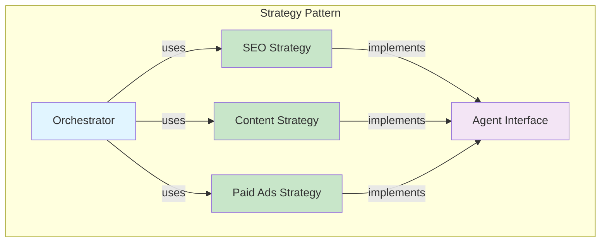

**Benefits:**
| Benefit | Explanation |
|---------|-------------|
| **Interchangeable** | Swap algorithms at runtime |
| **Isolated** | Each strategy is independent |
| **Testable** | Test strategies in isolation |

### Pattern 3: Repository Pattern

**Purpose:** Abstract database access logic.

📖 **Real-World Analogy:** A warehouse - you request items by ID, you don't care where they're stored.

#### Our Implementation

```python
# backend/app/interfaces/repositories.py - The Interface
class StrategyRepository(ABC):
    @abstractmethod
    def get_by_id(self, id): ...

    @abstractmethod
    def get_by_status(self, status): ...

# backend/app/infrastructure/repositories.py - The Implementation
class SQLAlchemyStrategyRepository(StrategyRepository):
    def __init__(self, session: Session):
        self.session = session
        self.model = Strategy

    def get_by_id(self, id):
        return self.session.query(self.model).filter_by(id=id).first()

    def get_by_status(self, status):
        return self.session.query(self.model).filter_by(status=status).all()

    def create_with_status(self, q_id, status, content):
        strategy = Strategy(questionnaire_id=q_id, status=status, ...)
        return self.save(strategy)
```

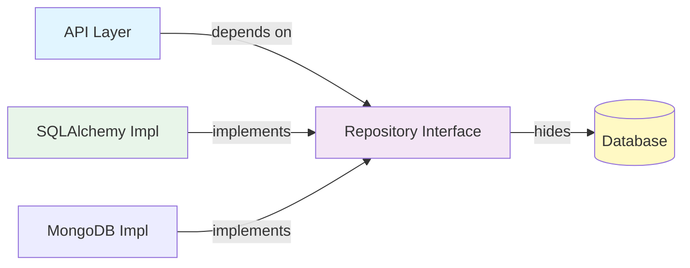

**Benefits:**
| Benefit | Explanation |
|---------|-------------|
| **Testability** | Mock repository for unit tests |
| **Flexibility** | Swap databases (PostgreSQL → MongoDB) |
| **Centralized** | All query logic in one place |
| **Caching** | Add caching at repository layer |

### Pattern 4: Dependency Injection

**Purpose:** Supply dependencies from outside rather than creating them inside.

📖 **Real-World Analogy:** Instead of building your own engine, you buy one and install it. Interchangeable!

#### Our Implementation

```python
# backend/app/agents/orchestrator.py
@dataclass
class OrchestratorConfig:
    """Configuration container for dependencies."""
    llm_provider: LLMProvider | None = None
    chain_factory: GroqChainFactory | None = None
    agent_factory: AgentFactory | None = None
    strategy_repository: StrategyRepository | None = None

class StrategyOrchestrator:
    def __init__(self, config: OrchestratorConfig):
        # Dependencies injected, not created
        self.llm = config.llm_provider or GroqLLMProvider()
        self.repo = config.strategy_repository or SQLAlchemyStrategyRepo(...)

# Usage - inject what you need
orchestrator = StrategyOrchestrator(
    OrchestratorConfig(
        llm_provider=OpenAILLMProvider(),      # Easy to swap!
        strategy_repo=MockStrategyRepository()  # Testing!
    )
)
```

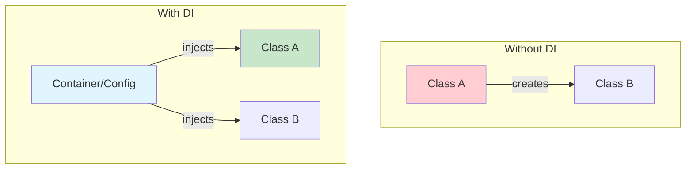

**Benefits:**
| Benefit | Explanation |
|---------|-------------|
| **Testability** | Inject mocks for testing |
| **Flexibility** | Swap implementations easily |
| **Configuration** | Control dependencies from one place |

### Pattern 5: Template Method Pattern

**Purpose:** Define algorithm skeleton, let subclasses customize steps.

📖 **Real-World Analogy:** Recipe template - "mix, bake, cool" is the skeleton, ingredients vary.

#### Our Implementation

```python
# backend/app/agents/base.py
class BaseLLMAgent(Agent):
    """Template for all LLM agents."""

    async def execute(self, context: AgentContext) -> StrategySection:
        """Template method - defines execution flow."""
        # 1. Check if should skip (customizable)
        if self.should_skip(context):
            return None

        # 2. Build parameters (customizable)
        params = self._build_params(context)

        # 3. Call LLM (same for all)
        return await self.chain.ainvoke(params)

    @abstractmethod
    def _build_params(self, context): ...  # Subclasses customize

    def should_skip(self, context): ...     # Subclasses customize

# Each agent customizes only the parts that differ
class SEOAgent(BaseLLMAgent):
    def _build_params(self, context):
        return {
            "products": ", ".join(context.products or []),
            # SEO-specific parameters
        }

class ContentAgent(BaseLLMAgent):
    def _build_params(self, context):
        return {
            "business_objectives": ", ".join(context.business_objectives),
            # Content-specific parameters
        }
```

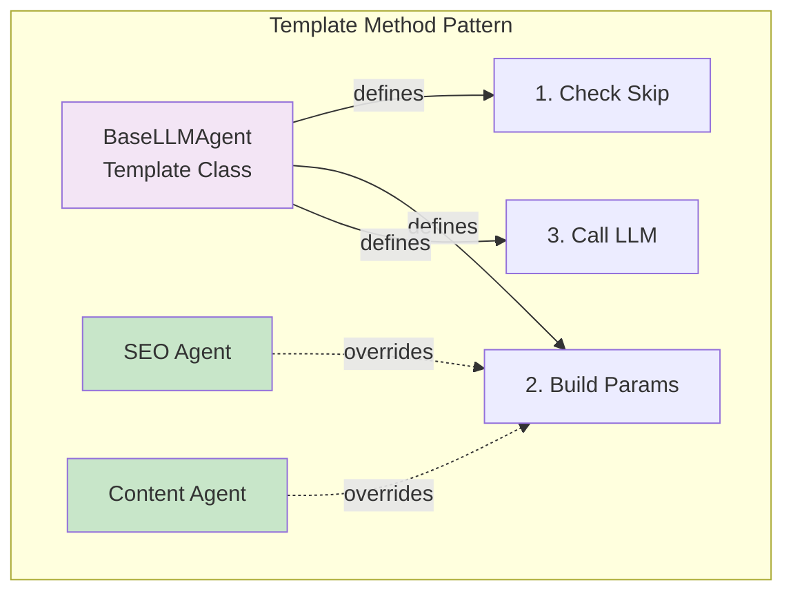

**Benefits:**
| Benefit | Explanation |
|---------|-------------|
| **Code Reuse** | Common logic in template |
| **Consistency** | All agents follow same flow |
| **Extensibility** | Add agents by extending base |

### Pattern 6: Builder Pattern

**Purpose:** Construct complex objects step by step.

📖 **Real-World Analogy:** Building a house - foundation → walls → roof → finish.

#### Our Implementation

```python
# backend/app/agents/orchestrator.py
class StrategyBuilder:
    """Builder for constructing strategy output."""

    @staticmethod
    def build_title(client_name: str) -> str:
        return f"Growth Strategy for {client_name}"

    @staticmethod
    def build_sections(sections: dict) -> list:
        return [s.model_dump() for s in sections.values()]

    @staticmethod
    def build_metadata(model: str, count: int) -> dict:
        return {"model": model, "sections_count": count}

    @classmethod
    def build(cls, context, sections, pricing, model) -> dict:
        """Build complete strategy step by step."""
        return {
            "title": cls.build_title(context.client_name),
            "sections": cls.build_sections(sections),
            "pricing": pricing,
            "metadata": cls.build_metadata(model, len(sections))
        }
```

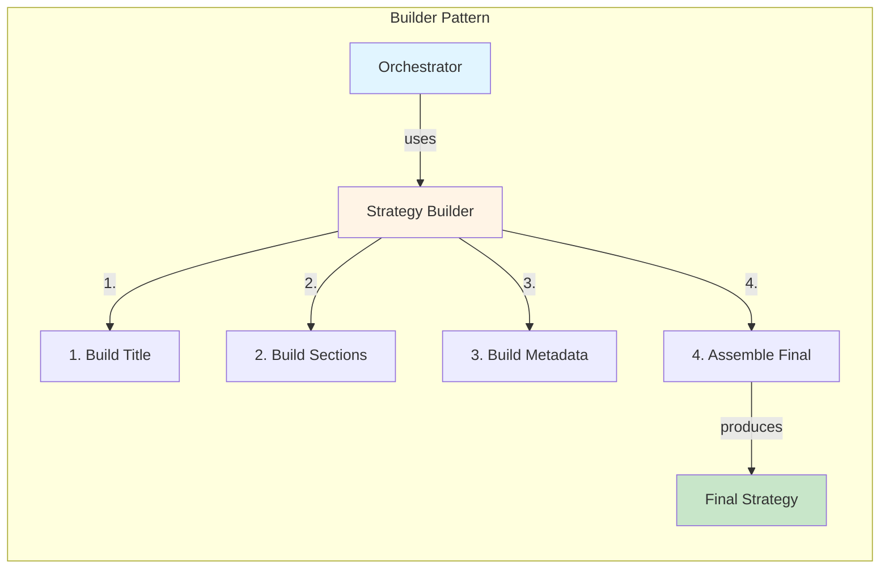

### Patterns Comparison

| Pattern | Solves | When to Use |
|---------|--------|-------------|
| **Factory** | Object creation | When you don't know concrete class until runtime |
| **Strategy** | Algorithm selection | When you have interchangeable algorithms |
| **Repository** | Data access | When you want to abstract database operations |
| **DI** | Dependency management | When you want to make code testable and flexible |
| **Template Method** | Algorithm skeleton | When steps are same, implementations vary |
| **Builder** | Complex construction | When objects have many parts |

---

## 5. Database Design

### Relational Database Basics

A **relational database** organizes data into **tables** with relationships between them.

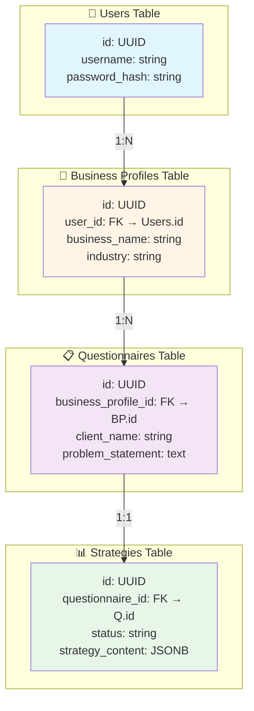

### ERD (Entity Relationship Diagram)

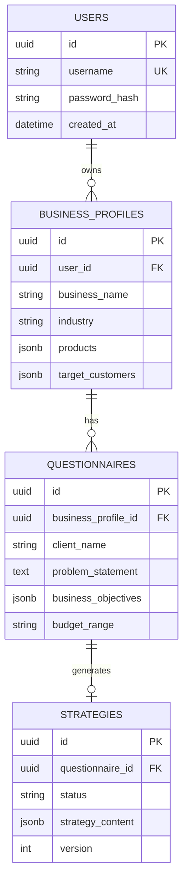

### Database Relationships

| Relationship | Symbol | Meaning | Example |
|--------------|--------|---------|---------|
| **One-to-One** | `1:1` | One record relates to one other | User → Profile |
| **One-to-Many** | `1:N` | One record relates to many others | User → Profiles |
| **Many-to-Many** | `M:N` | Many records relate to many others | Students ↔ Classes |

### Normalization

**Normalization** organizes data to reduce redundancy.

❌ **Not Normalized (Bad):**
```sql
-- Duplicate data!
INSERT INTO orders (customer_name, customer_email, product, total)
VALUES ('John', 'john@email.com', 'Widget', 100);

INSERT INTO orders (customer_name, customer_email, product, total)
VALUES ('John', 'john@email.com', 'Gadget', 200);
```

✅ **Normalized (Good):**
```sql
-- Separate tables
INSERT INTO customers (id, name, email) VALUES (1, 'John', 'john@email.com');

INSERT INTO orders (customer_id, product, total) VALUES (1, 'Widget', 100);
INSERT INTO orders (customer_id, product, total) VALUES (1, 'Gadget', 200);
```

### Our Database Schema

```python
# backend/app/models/user.py
class User(Base):
    __tablename__ = "users"

    id = Column(UUID, primary_key=True)
    username = Column(String, unique=True)      # ← No duplicates
    password_hash = Column(String)              # ← Never store plain passwords!

# backend/app/models/business_profile.py
class BusinessProfile(Base):
    __tablename__ = "business_profiles"

    id = Column(UUID, primary_key=True)
    user_id = Column(UUID, ForeignKey("users.id"))  # ← Foreign key
    business_name = Column(String)
    products = Column(JSON)                          # ← Flexible schema
```

### SQLAlchemy ORM

**ORM** (Object-Relational Mapping) lets you work with **objects** instead of SQL.

❌ **Raw SQL:**
```python
result = db.execute(
    "SELECT * FROM strategies WHERE questionnaire_id = :id",
    {"id": q_id}
).fetchone()
```

✅ **ORM:**
```python
strategy = db.query(Strategy).filter_by(questionnaire_id=q_id).first()
```

### Migrations with Alembic

**Migrations** version-control your database schema.

```bash
# Create migration
alembic revision --autogenerate -m "Add pricing to strategies"

# Apply migration
alembic upgrade head

# Rollback
alembic downgrade -1
```

---

## 6. API Design

### What is an API?

**API** (Application Programming Interface) allows different software to communicate.

📖 **Real-World Analogy:** A restaurant menu - you order from the menu, kitchen prepares, you get food. You don't need to know how the kitchen works!

### RESTful API Design

**REST** (Representational State Transfer) uses **HTTP methods** as actions.

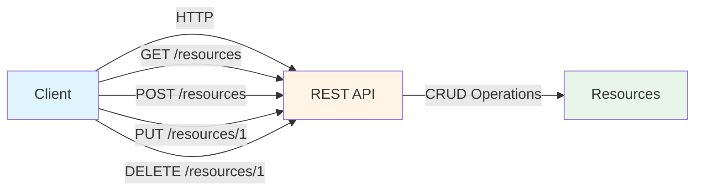

### HTTP Methods

| Method | Purpose | Example | Idempotent? |
|--------|---------|---------|-------------|
| **GET** | Retrieve data | `GET /api/strategies/123` | ✅ Yes |
| **POST** | Create resource | `POST /api/strategies/generate` | ❌ No |
| **PUT** | Update resource | `PUT /api/strategies/123` | ✅ Yes |
| **PATCH** | Partial update | `PATCH /api/strategies/123` | ❌ No |
| **DELETE** | Remove resource | `DELETE /api/strategies/123` | ✅ Yes |

> **Idempotent:** Running the request multiple times has the same effect as running it once.

### Our API Endpoints

```python
# backend/app/api/strategies.py
@router.post("/generate")              # Create
async def generate_strategy(...): pass

@router.get("/{strategy_id}")          # Read
async def get_strategy(...): pass

@router.put("/{strategy_id}")          # Update
async def update_strategy(...): pass

@router.get("/{strategy_id}/status")   # Read status
async def get_strategy_status(...): pass
```

### Request/Response Cycle

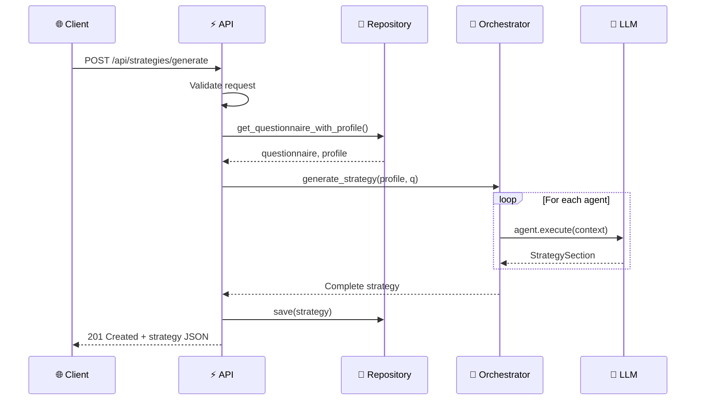

### Status Codes

| Code | Meaning | When to Use |
|------|---------|-------------|
| **200** | OK | Successful GET, PUT, DELETE |
| **201** | Created | Successful POST |
| **204** | No Content | Successful DELETE with no return body |
| **400** | Bad Request | Invalid input |
| **401** | Unauthorized | Missing/invalid authentication |
| **403** | Forbidden | Authenticated but not authorized |
| **404** | Not Found | Resource doesn't exist |
| **429** | Too Many Requests | Rate limit exceeded |
| **500** | Server Error | Something went wrong |

### Input Validation with Pydantic

```python
# backend/app/schemas/strategy.py
from pydantic import BaseModel, Field

class StrategyGenerate(BaseModel):
    """Request schema with validation."""
    questionnaire_id: UUID = Field(..., description="Questionnaire ID")

    class Config:
        json_schema_extra = {
            "example": {"questionnaire_id": "123e4567-e89b-12d3-a456-426614174000"}
        }

class StrategyResponse(BaseModel):
    """Response schema."""
    id: UUID
    questionnaire_id: UUID
    strategy_content: dict | None
    status: str
    created_at: datetime
```

### Pagination

For large datasets, return data in **pages**.

```python
@router.get("/strategies")
async def list_strategies(
    page: int = 1,
    per_page: int = 20,
    db: Session = Depends(get_db)
):
    """List strategies with pagination."""
    offset = (page - 1) * per_page
    strategies = db.query(Strategy).offset(offset).limit(per_page).all()

    return {
        "data": strategies,
        "page": page,
        "per_page": per_page,
        "total": db.query(Strategy).count()
    }
```

---

## 7. Authentication & Authorization

### Authentication vs Authorization

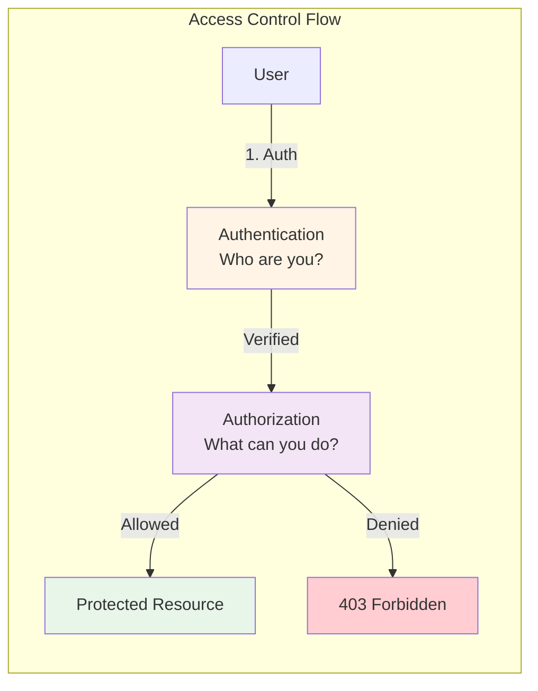

| Concept | Question | Implementation |
|----------|----------|----------------|
| **Authentication** | Who are you? | JWT tokens |
| **Authorization** | What can you do? | Role-based access control |

### JWT (JSON Web Tokens)

**JWT** is a stateless way to authenticate requests.

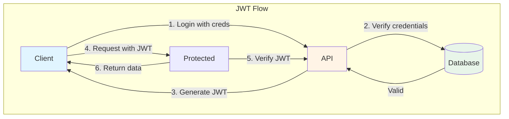

**JWT Structure:**
```
header.payload.signature

{
  "alg": "HS256"
}.{
  "user_id": "123",
  "exp": 1234567890
}.signature
```

### Our Implementation

```python
# backend/app/api/auth.py
@router.post("/login")
async def login(credentials: UserLogin, db: Session = Depends(get_db)):
    """Authenticate user and return JWT."""
    # 1. Verify credentials
    user = db.query(User).filter_by(username=credentials.username).first()
    if not user or not verify_password(credentials.password, user.password_hash):
        raise HTTPException(401, "Invalid credentials")

    # 2. Generate JWT
    access_token = create_access_token(data={"sub": str(user.id)})

    # 3. Return token
    return {"access_token": access_token, "token_type": "bearer"}

# Protected endpoint
@router.get("/me")
async def get_current_user(token: str = Depends(oauth2_scheme)):
    """Get current user from JWT."""
    return current_user
```

### Protecting Endpoints

```python
from fastapi import Depends
from app.utils.security import get_current_user

@router.get("/strategies")
async def get_strategies(
    user: User = Depends(get_current_user),  # ← Require auth
    db: Session = Depends(get_db)
):
    """Only authenticated users can access."""
    return db.query(Strategy).filter_by(user_id=user.id).all()
```

---

## 8. Caching Strategies

### Why Cache?

Caching stores frequently-accessed data in **fast storage** (memory) to avoid slow operations (database queries, API calls).

```mermaid
graph LR
    Client[Client] -->|1. Request| App[Application]
    App -->|2. Check| Cache[Cache Layer]

    Cache -->|Hit| App
    Cache -->|Miss| DB[(Database)]
    DB -->|3. Return data| Cache
    Cache -->|4. Store| Cache

    Cache -->|5. Return| App
    App -->|6. Response| Client

    style Cache fill:#fff9c4
    style DB fill:#e8f5e9
```

### Cache Strategies

| Strategy | When to Use | Pros | Cons |
|----------|-------------|------|------|
| **Cache-Aside** | Read-heavy | Simple | Stale data possible |
| **Write-Through** | Consistency critical | Always fresh | Slower writes |
| **Write-Behind** | Write-heavy | Fast writes | Data loss possible |
| **Write-Around** | Data written once | Simple | Cache miss on first read |

### Redis Integration

```python
import redis
from app.config import settings

class CacheService:
    def __init__(self):
        self.redis = redis.from_url(settings.REDIS_URL)

    async def get(self, key: str):
        """Get from cache."""
        value = await self.redis.get(key)
        return json.loads(value) if value else None

    async def set(self, key: str, value: dict, ttl: int = 3600):
        """Set in cache with TTL."""
        await self.redis.setex(key, ttl, json.dumps(value))

    async def invalidate(self, pattern: str):
        """Invalidate keys matching pattern."""
        for key in await self.redis.keys(pattern):
            await self.redis.delete(key)

# Usage
cache = CacheService()

# Try cache first
cached_strategy = await cache.get(f"strategy:{strategy_id}")
if cached_strategy:
    return cached_strategy

# Cache miss - fetch and store
strategy = await repository.get_by_id(strategy_id)
await cache.set(f"strategy:{strategy_id}", strategy, ttl=3600)
```

### Cache Invalidation

**When data changes, invalidate related cache.**

```python
@router.put("/strategies/{id}")
async def update_strategy(id: UUID, data: StrategyUpdate):
    strategy = repository.get_by_id(id)
    strategy.content = data.content
    repository.save(strategy)

    # Invalidate cache
    await cache.invalidate(f"strategy:{id}")
    await cache.invalidate("strategies:*")  # Invalidate list too

    return strategy
```

---

## 9. Scalability Patterns

### Vertical vs Horizontal Scaling

```mermaid
graph TB
    subgraph "Vertical Scaling (Up)"
        direction TB
        S1[Small Server<br/>2 CPU, 4GB RAM]
        S2[Medium Server<br/>4 CPU, 8GB RAM]
        S3[Large Server<br/>16 CPU, 32GB RAM]

        S1 -->|upgrade| S2
        S2 -->|upgrade| S3
    end

    subgraph "Horizontal Scaling (Out)"
        direction LR
        L1[Load Balancer]
        S1a[Server 1]
        S2a[Server 2]
        S3a[Server 3]

        L1 --> S1a
        L1 --> S2a
        L1 --> S3a
    end

    style S1 fill:#ffcdd2
    style S2 fill:#fff9c4
    style S3 fill:#c8e6c9
    style L1 fill:#e1f5ff
```

| Approach | Description | When to Use |
|----------|-------------|-------------|
| **Vertical** | Upgrade server resources | Simple apps, single machine |
| **Horizontal** | Add more servers | Distributed systems |

### Load Balancing

```mermaid
graph LR
    Users[Users] -->|Requests| LB[Load Balancer]

    LB -->|Round Robin| S1[Server 1]
    LB -->|Round Robin| S2[Server 2]
    LB -->|Round Robin| S3[Server 3]

    S1 -->|All connect to| DB[(Shared Database)]
    S2 -->|All connect to| DB
    S3 -->|All connect to| DB

    style LB fill:#e1f5ff
    style S1 fill:#c8e6c9
    style S2 fill:#c8e6c9
    style S3 fill:#c8e6c9
    style DB fill:#fff9c4
```

### Asynchronous Processing

For **long-running tasks** (like AI generation), don't block the API response.

```mermaid
sequenceDiagram
    participant U as User
    participant A as API
    participant Q as Queue
    participant W as Worker
    participant L as LLM

    U->>A: POST /generate
    A->>A: Create strategy (status=generating)
    A->>Q: Enqueue job
    A-->>U: 202 Accepted (strategy_id)

    Q->>W: Process job
    W->>L: Generate strategy
    L-->>W: Strategy content
    W->>DB: Update strategy (status=completed)

    U->>A: GET /strategies/{id}
    A->>DB: Check status
    A-->>U: Strategy (polling or webhook)
```

**Implementation with Celery:**
```python
# tasks.py
@celery_app.task
def generate_strategy_task(strategy_id: UUID):
    """Run strategy generation in background."""
    strategy = db.get_strategy(strategy_id)

    # Generate (can take 30+ seconds)
    result = orchestrator.generate(...)

    # Update database
    strategy.content = result
    strategy.status = "completed"
    db.save(strategy)

# api.py
@router.post("/generate")
async def generate(request):
    strategy = Strategy(status="generating")
    db.save(strategy)

    # Queue task - returns immediately!
    generate_strategy_task.delay(strategy.id)

    return {"strategy_id": strategy.id, "status": "generating"}
```

---

## 10. Testing Strategy

### Testing Pyramid

```mermaid
graph TB
    subgraph "Testing Pyramid"
        E2E[End-to-End Tests<br/>10%<br/>Slow, Expensive]
        INT[Integration Tests<br/>30%<br/>Medium]
        UNIT[Unit Tests<br/>60%<br/>Fast, Cheap]
    end

    E2E --> INT
    INT --> UNIT

    style E2E fill:#ffcdd2
    style INT fill:#fff9c4
    style UNIT fill:#c8e6c9
```

### Unit Tests

Test **individual components** in isolation.

```python
# tests/test_agents/test_seo_agent.py
import pytest
from unittest.mock import AsyncMock, Mock

@pytest.mark.asyncio
class TestSEOAgent:
    """Unit tests for SEOAgent."""

    async def test_execute_generates_section(self):
        """Test agent generates strategy section."""
        # Arrange
        mock_chain = AsyncMock()
        mock_chain.ainvoke.return_value = Mock(
            heading="SEO Strategy",
            content="Optimize for keywords",
            tactics=["Add meta tags"],
            kpis["Rank in top 10"]
        )

        agent = SEOAgent(mock_chain, "seo_section")
        context = Mock(client_name="Test Corp")

        # Act
        result = await agent.execute(context)

        # Assert
        assert result.heading == "SEO Strategy"
        mock_chain.ainvoke.assert_called_once()
```

### Integration Tests

Test **how components work together**.

```python
# tests/integration/test_strategy_flow.py
import pytest
from httpx import AsyncClient

@pytest.mark.asyncio
async def test_full_generation_flow(client: AsyncClient, db: Session):
    """Test complete strategy generation flow."""
    # 1. Create business profile
    profile = await client.post("/api/profiles", json={
        "business_name": "Test Corp",
        "industry": "Technology"
    })

    # 2. Create questionnaire
    questionnaire = await client.post("/api/questionnaires", json={
        "business_profile_id": profile.json()["id"],
        "client_name": "Test Client",
        "budget_range": "$5000"
    })

    # 3. Generate strategy
    strategy = await client.post("/api/strategies/generate", json={
        "questionnaire_id": questionnaire.json()["id"]
    })

    # 4. Verify result
    assert strategy.status_code == 201
    assert strategy.json()["status"] == "completed"
```

### Test Fixtures

```python
# tests/conftest.py
@pytest.fixture
async def db_session():
    """Create test database session."""
    engine = create_async_engine("sqlite+aiosqlite:///:memory:")
    async with engine.begin() as conn:
        await conn.run_sync(Base.metadata.create_all)

    async_session = sessionmaker(engine, class_=AsyncSession)
    async with async_session() as session:
        yield session
        await session.rollback()

@pytest.fixture
async def client(db_session):
    """Create test HTTP client."""
    async with AsyncClient(app=app) as ac:
        app.dependency_overrides[get_db] = lambda: db_session
        yield ac
```

---

## 11. Deployment

### Deployment Architecture

```mermaid
graph TB
    subgraph "Production Environment"
        Internet[Internet]

        subgraph "🌐 CDN"
            CDN[CloudFlare / CloudFront]
        end

        subgraph "⚖️ Load Balancer"
            LB[Nginx / ALB]
        end

        subgraph "🐳 Application Servers"
            S1[App Server 1]
            S2[App Server 2]
            S3[App Server 3]
        end

        subgraph "💾 Data Layer"
            PG[(PostgreSQL<br/>Primary)]
            REPLICA[(PostgreSQL<br/>Replica)]
            REDIS[(Redis Cache)]
        end

        subgraph "🔒 Services"
            LLM[Groq API]
        end
    end

    Internet --> CDN
    CDN --> LB
    LB --> S1
    LB --> S2
    LB --> S3

    S1 --> PG
    S2 --> PG
    S3 --> PG
    PG --> REPLICA

    S1 --> REDIS
    S2 --> REDIS
    S3 --> REDIS

    S1 --> LLM
    S2 --> LLM
    S3 --> LLM

    style CDN fill:#e1f5ff
    style LB fill:#fff4e6
    style PG fill:#e8f5e9
    style REDIS fill:#fff9c4
```

### Docker Deployment

```dockerfile
# Dockerfile
FROM python:3.11-slim

WORKDIR /app

# Install dependencies
COPY requirements.txt .
RUN pip install --no-cache-dir -r requirements.txt

# Copy application
COPY . .

# Run with gunicorn (production server)
CMD ["gunicorn", "app.main:app", "--bind", "0.0.0.0:8000", "--workers", "4"]
```

```yaml
# docker-compose.yml
version: '3.8'
services:
  app:
    build: .
    ports:
      - "8000:8000"
    environment:
      - DATABASE_URL=postgresql://user:pass@db:5432/app
    depends_on:
      - db
      - redis

  db:
    image: postgres:15-alpine
    volumes:
      - postgres_data:/var/lib/postgresql/data

  redis:
    image: redis:7-alpine

volumes:
  postgres_data:
```

---

## 12. Monitoring & Observability

### Observability Pillars

```mermaid
graph TB
    subgraph "Observability"
        Logs[Logs<br/>What happened?]
        Metrics[Metrics<br/>How much/many?]
        Traces[Traces<br/>Why slow?]
    end

    Logs -->|Combined| Observability[Observability<br/>Platform]
    Metrics -->|Combined| Observability
    Traces -->|Combined| Observability

    style Logs fill:#e1f5ff
    style Metrics fill:#fff4e6
    style Observability fill:#c8e6c9
```

### Structured Logging

```json
{
  "timestamp": "2026-02-07T12:00:00Z",
  "level": "info",
  "logger": "app.agents.orchestrator",
  "message": "strategy_generation_started",
  "request_id": "abc-123",
  "client_name": "TechCorp",
  "user_id": "user-456"
}
```

### Metrics

```python
from prometheus_client import Counter, Histogram

# Counters - track totals
strategy_requests = Counter(
    'strategy_requests_total',
    'Total strategy requests',
    ['status']  # Labels: success, error
)

# Histograms - track distributions
generation_duration = Histogram(
    'strategy_generation_seconds',
    'Strategy generation duration',
    buckets=[5, 10, 30, 60, 120]
)

# Usage
strategy_requests.labels(status='success').inc()
generation_duration.observe(45.2)
```

### Health Checks

```python
@router.get("/health")
async def health_check():
    """Comprehensive health check."""
    checks = {
        "database": check_database(),
        "redis": check_redis(),
        "llm_api": check_llm_api(),
    }

    healthy = all(checks.values())
    return {
        "status": "healthy" if healthy else "unhealthy",
        "checks": checks
    }
```

---

## Quick Reference

### Architecture Checklist

| ✅ Component | Status | Notes |
|-------------|--------|-------|
| **API Layer** | ✅ FastAPI | REST endpoints with Pydantic validation |
| **Business Logic** | ✅ Orchestrator | LangGraph multi-agent system |
| **Data Access** | ✅ Repository | Abstract repositories with SQLAlchemy |
| **Database** | ✅ PostgreSQL | Relational with JSONB columns |
| **LLM** | ✅ Groq | Fast Llama 3.1 via Groq |
| **Caching** | 📝 Redis | Documented, not implemented |
| **Queue** | 📝 Celery | Documented for async tasks |
| **Testing** | 📝 Pytest | Examples in docs |

### Design Principles Checklist

| Principle | Applied | Where |
|-----------|---------|------|
| **SRP** | ✅ | Each repository, agent has one job |
| **OCP** | ✅ | Add agents via factory pattern |
| **LSP** | ✅ | LLMProvider interface, any implementation works |
| **ISP** | ✅ | Small, focused interfaces |
| **DIP** | ✅ | Inject dependencies via OrchestratorConfig |
| **DRY** | ✅ | Base repository, shared agent runner |
| **YAGNI** | ✅ | Removed unused models and schemas |

### Design Patterns Used

| Pattern | File | Purpose |
|---------|------|---------|
| **Factory** | `agents/factory.py` | Create agent instances |
| **Strategy** | `agents/base.py` | Interchangeable agent behaviors |
| **Repository** | `infrastructure/repositories.py` | Database access abstraction |
| **DI** | `agents/orchestrator.py` | Inject dependencies |
| **Template Method** | `agents/base.py` | Agent execution skeleton |
| **Builder** | `agents/orchestrator.py` | Construct strategy output |

---

## Further Learning

### Recommended Resources

| Topic | Resource | Link |
|-------|----------|------|
| **System Design** | "System Design Interview" | alex xu |
| **API Design** | "RESTful Web APIs" | Leonard Richardson |
| **Design Patterns** | "Refactoring.guru" | refactoring.guru |
| **FastAPI** | Official Docs | fastapi.tiangolo.com |
| **Python Async** | "Async IO" | docs.python.org/3/library/asyncio |

---

## Conclusion

This backend demonstrates **production-ready patterns** including:

✅ **SOLID principles** - Clean, maintainable code
✅ **Design patterns** - Factory, Strategy, Repository, DI
✅ **Layered architecture** - Clear separation of concerns
✅ **API design** - RESTful with proper status codes
✅ **Database design** - Normalized with proper relationships
✅ **Resilience** - Retry, circuit breaker, timeouts
✅ **Observability** - Structured logging, health checks

Use this codebase as a **reference** for building scalable, maintainable backend systems!
